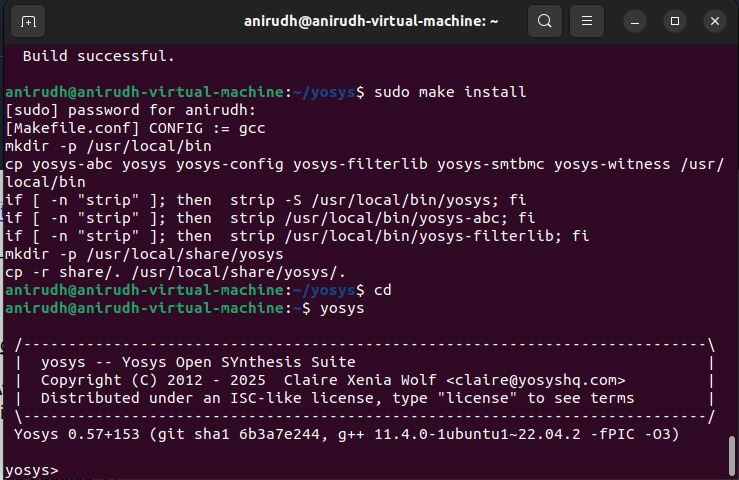
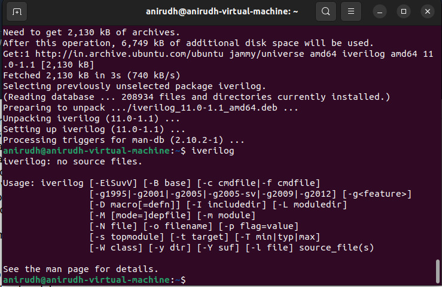
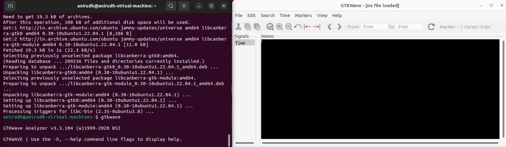

# RISC-V SoC Tapeout Program (VSD)

## 1. Introduction
This document outlines the installation process for the required tools to run the RISC-V SoC Tapeout Program.

## 2. System Requirements

- **Operating System**: Ubuntu 20.04 or higher  
- **RAM**: 6 GB minimum  
- **Disk Space**: 50 GB HDD  
- **CPUs**: 4 vCPUs 

## 3. Installing Required Tools

### 3.1 Yosys

```bash
$ sudo apt-get update
$ git clone https://github.com/YosysHQ/yosys.git
$ cd yosys
$ sudo apt install make               # If make is not installed
$ sudo apt-get install build-essential clang bison flex \
    libreadline-dev gawk tcl-dev libffi-dev git \
    graphviz xdot pkg-config python3 libboost-system-dev \
    libboost-python-dev libboost-filesystem-dev zlib1g-dev
$ make config-gcc
$ git submodule update --init abc  # Initialize abc submodule
$ make
$ sudo make install
```


### 3.2 iVerilog

```bash
$ sudo apt-get update
$ sudo apt-get install iverilog
```




### 3.3 gtkwave

```bash
$ sudo apt-get update
$ sudo apt install gtkwave
```

